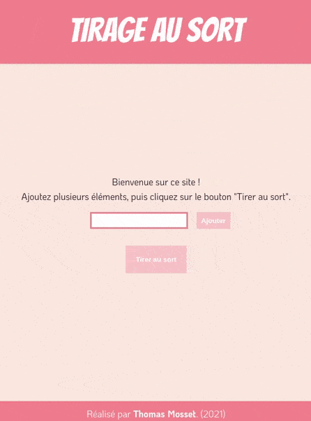

# vue-js-tirage-sort

## English

This app is a list draw. 

It allows the user to add as many element as they want. The app sorts 1 element from the list. The user can delete 1 one element as well as all the elements stocked in the list.

[Demo access](https://tirage-au-sort.herokuapp.com/)

## French

Cette application permet de tirer au sort 1 élément d'une liste rentrée préalablement par l'utilisateur / l'utilisatrice. Il est possible de supprimer 1 seul élément de cette liste ou bien de supprimer l'entièreté des éléments de la liste.

[Accéder à la démo](https://tirage-au-sort.herokuapp.com/)

